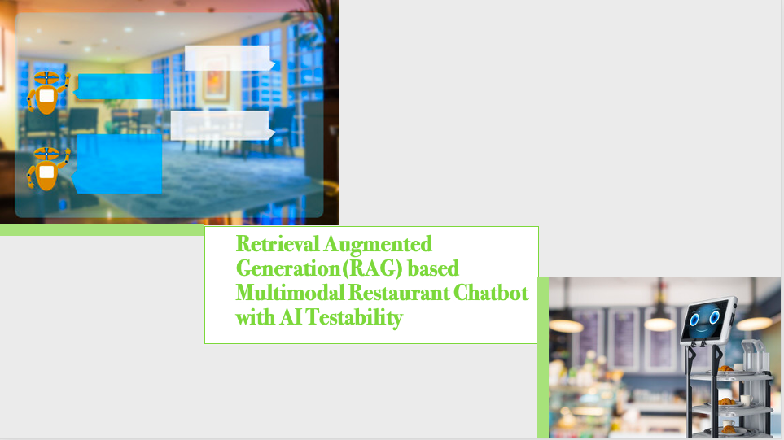
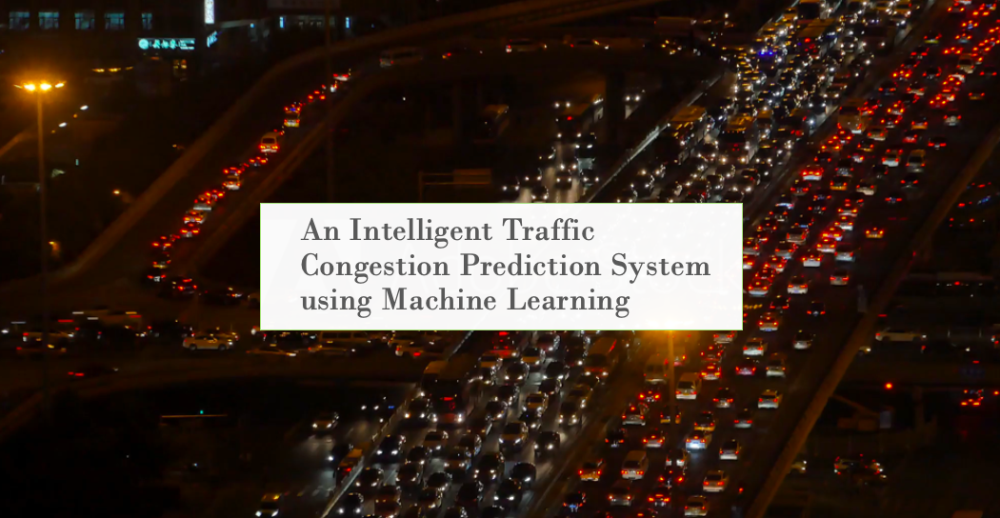
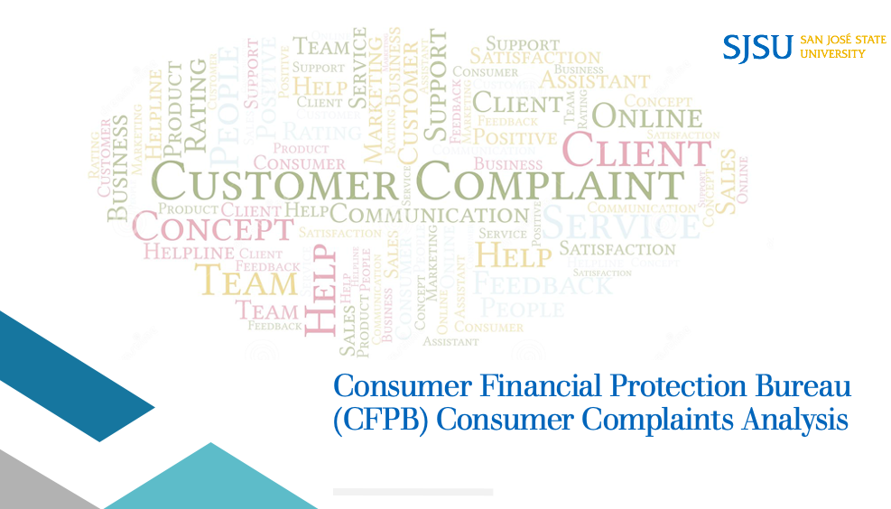

<!--<h1 align = "center">Hi, I am Vani Bhat👋</h1> -->
<h1 align = "center">Hi, I am Vani Bhat👋</h1>

Machine Learning Engineer | 8 years of software engineering work experience | Actively seeking full time opportunities in AI / ML | Deep Learning, Generative AI, NLP, and Computer Vision| Masters in Applied Data Science and Analytics from San Jose State University

<h2 align = "center"> 📫 How to reach me ? </h2>

  

<h2 align= "center">About me</h2>

I recently completed my master’s in applied data science and Analytics from San Jose State University. 

My recent work involves developing a Generative AI based restaurant chatbot that can assist customers with booking tables, inquiring about the menu, and placing orders. My work gave me an exposure to Retrieval Augmented Generation (RAG), fine-tuning of Auto-Regressive Large Language Models, LLM evalution methods and Knowledge Graphs.

Prior to this, I gained machine-learning experience through my two internships. 
  •	Completed my 2023 summer internship as a Machine Learning Engineer at Hologic, where I engineered a comprehensive solution that combined vision and language processing to address the breast cancer detection and annotation problem, utilizing advanced techniques like CLIP vision transformers on an dataset of 11,000 image-text pairs from medical reports using LLM prompting techniques.
  •	I gained practical experience as an AI Engineer Intern at nth Venture, a startup eco-system where, I developed a predictive model that assessed the likelihood of customer calls converting into product sales.

Before my Masters, I also worked as a senior engineer in software industry for 8 years with IBM and UHG/OptumRx where I have worked extensively on Object Oriented Programming both in Python and Java to develop and validate various healthcare functionalities. I have also have led a team to finalise the client requirements, design solutions and also develop code.

Overall, my academic expertise, practical exposure to cutting-edge technology stacks through internships, and substantial software industry expertise positions me to contribute significantly to problem-solving, technical innovation, and collaborative team environments. My commitment to keep up to date with recent advancements and a proactive "can learn and can do" attitude makes me confident in delivering valuable contributions.

<h2 align= "center"> Skills: Tools and Technologies </h2>

<h2 align= "center"> Academic Projects </h2>

| [RAG based multi modal restaurant chatbot with AI testability](https://github.com/vanibhat02/AI-Chatbot-RAG-LLM) | |[Deep Learning Approach for Deep Fake Video Detection](https://github.com/vanibhat02/Deep_Learning/tree/main/DeepFakeVideoDetection) | 
| :-: | :-: | :-: |
|  | &nbsp; |  |

| [Machine Learning Powered Credit Card Fraud Detection](https://github.com/vanibhat02/Machine-Learning/tree/main/CreditCardFraudDetection) |  | [Intelligent Traffic Congestion Prediction System](https://github.com/vanibhat02/Machine-Learning/tree/main/IntelligentTrafficCongestionPredictionSystem) |
| :-: | :-: | :-: |
|  | &nbsp; | |

| [Deep Learning: Flood Detection From Social Media Imagery](https://github.com/vanibhat02/Deep_Learning/tree/main/FloodDetectionUsingSocialMediaImagery) |  | [Big Data: Califoria House Price Prediction using AWS ](https://github.com/vanibhat02/Big-Data/tree/main/CaliforniaHousePricePrediction) | 
| :-: | :-: | :-: |
|  | &nbsp; |  |

| [Graph Database Powered Recommendation System](https://github.com/vanibhat02/NoSQL_Database/tree/main/graph_database_recommendation_system) | |[CFPB Consumer Complaints Analysis](https://github.com/vanibhat02/Data-Visualisation/tree/main/CFPB_Consumer_Complaint_Analysis) |
| :-: | :-: | :-: |
|  | &nbsp; | |

| [Twitter Sentiment Analysis for Medical Conditions](https://github.com/vanibhat02/Natural-Language-Processing/tree/main/NLPTwitter%20Sentiment%20Analysis%20For%20Medical%20Conditions) | 
| :-: | 
|  | 

<!--
<!--
**vanibhat02/vanibhat02** is a ✨ _special_ ✨ repository because its `README.md` (this file) appears on your GitHub profile.

Here are some ideas to get you started:

- 🔭 I’m currently working on ...
- 🌱 I’m currently learning ...
- 👯 I’m looking to collaborate on ...
- 🤔 I’m looking for help with ...
- 💬 Ask me about ...
- 📫 How to reach me: ...
- 😄 Pronouns: ...
- ⚡ Fun fact: ...
-->

